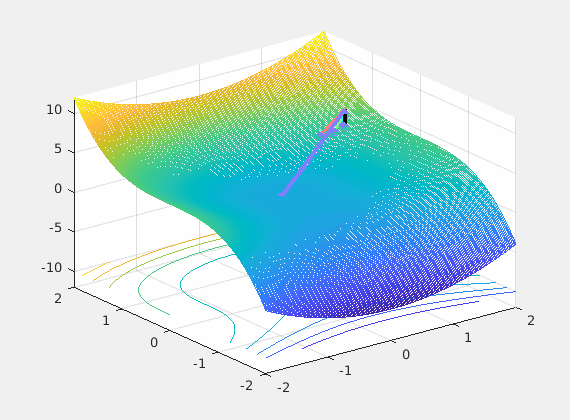

# Optimizer Visualization

Visualization of AI Optimizers.

## Optimizers

Our supporting optimizers.

From `GD` to `NAdam` are referenced ([arxiv 1609.04747 - Understanding Gradient Descent Algorithm](https://arxiv.org/abs/1908.03265))

- GD (Gradient Descent)
- SGD (Stochastic Gradient Descent)
- Momentum
- NAG (Nesterov accelerated gradient)
- Adagrad
- AdaDelta
- RMSProp
- Adam
- NAdam
- RAdam ([arxiv 1908.03265 - On the Variance of the Adaptive Learning Rate and Beyond](https://arxiv.org/abs/1908.03265))

If you want any more optimizers to add here, please write on [issues](https://github.com/Kitsunetic/Optimizer-Visualization/issues) tab.
